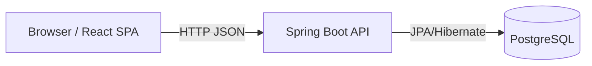
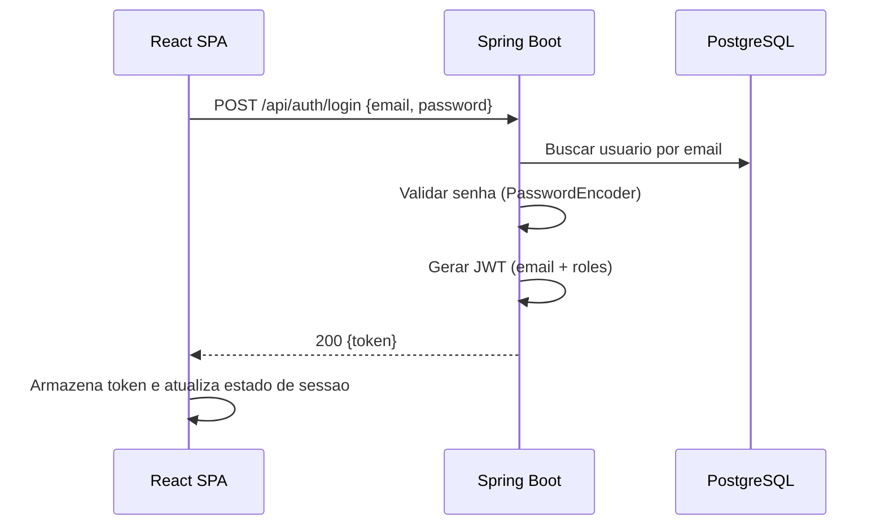
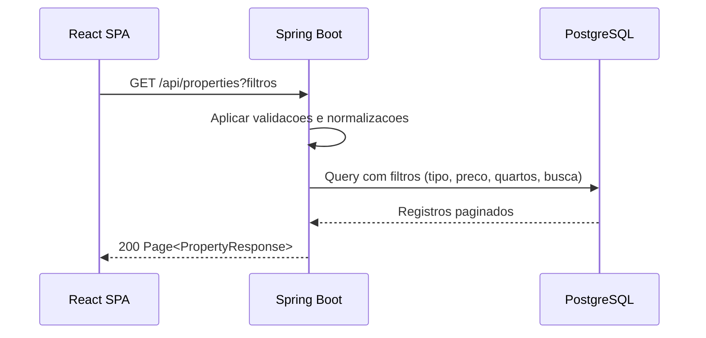
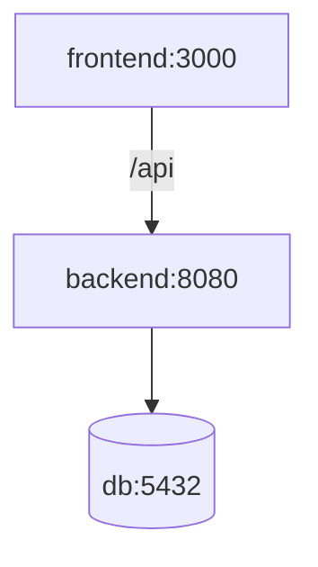

# Architecture Overview - Real Estate Platform

Este documento descreve a arquitetura atual da aplicacao, com foco em organizacao tecnica, responsabilidades por camada e operacao em ambiente local e cloud.

## 1. High-Level View



## 2. Tech Stack

- Frontend: React 18, TypeScript, Vite
- Backend: Spring Boot 3.5, Java 21, Spring Security, JPA/Hibernate
- Database: PostgreSQL 16
- Infra local: Docker Compose
- Auth: JWT (Bearer token)

## 3. Component Architecture

### 3.1 Frontend

Principais responsabilidades:
- Renderizacao das telas (home, detalhe, favoritos, gestao, login, admin)
- Controle de sessao no AuthContext
- Chamadas HTTP centralizadas em utilitario de API
- Envio de token JWT no header Authorization quando necessario

Componentes principais:
- App e roteamento: [frontend/src/App.tsx](frontend/src/App.tsx)
- Pagina Home: [frontend/src/pages/PropertyListPage.tsx](frontend/src/pages/PropertyListPage.tsx)
- Pagina Detalhe: [frontend/src/pages/PropertyDetailPage.tsx](frontend/src/pages/PropertyDetailPage.tsx)
- Pagina Favoritos: [frontend/src/pages/FavoritesPage.tsx](frontend/src/pages/FavoritesPage.tsx)
- Pagina Gestao: [frontend/src/pages/PropertyManagementPage.tsx](frontend/src/pages/PropertyManagementPage.tsx)
- Cliente HTTP: [frontend/src/utils/api.ts](frontend/src/utils/api.ts)

### 3.2 Backend

Arquitetura em camadas:
- Controller: recebe requests, valida DTOs e responde HTTP
- Service: regras de negocio e orquestracao
- Repository: consultas JPA e filtros customizados
- Entity: modelo persistente

Componentes principais:
- Controllers: [backend/src/main/java/com/example/realestate/controller](backend/src/main/java/com/example/realestate/controller)
- Services: [backend/src/main/java/com/example/realestate/service](backend/src/main/java/com/example/realestate/service)
- Repositories: [backend/src/main/java/com/example/realestate/repository](backend/src/main/java/com/example/realestate/repository)
- Security: [backend/src/main/java/com/example/realestate/security](backend/src/main/java/com/example/realestate/security)
- Config: [backend/src/main/resources/application.yml](backend/src/main/resources/application.yml)

## 4. Runtime Request Flow

### 4.1 Login



### 4.2 Listagem de imoveis



## 5. Security Model

Autenticacao e autorizacao:
- JWT stateless
- Filtro customizado para extracao/validacao do token
- Controle de acesso por role e regra de ownership

Perfis:
- ROLE_ADMIN: controle total
- ROLE_AGENT: gerencia os proprios imoveis
- ROLE_CLIENT: consumo de funcionalidades de consulta/favoritos

Regras importantes:
- Endpoints publicos de consulta podem ser anonimos
- Endpoints de escrita exigem autenticacao
- Exclusao/edicao respeita ownership (exceto admin)

Arquivos de referencia:
- [backend/src/main/java/com/example/realestate/security/SecurityConfig.java](backend/src/main/java/com/example/realestate/security/SecurityConfig.java)
- [backend/src/main/java/com/example/realestate/security/JwtAuthenticationFilter.java](backend/src/main/java/com/example/realestate/security/JwtAuthenticationFilter.java)
- [backend/src/main/java/com/example/realestate/security/JwtTokenProvider.java](backend/src/main/java/com/example/realestate/security/JwtTokenProvider.java)

## 6. Data Model

Entidades centrais:
- User
- Property
- Favorite
- user_roles (colecao de roles do usuario)
- property_images (colecao de urls de imagem do imovel)

Relacionamentos:
- User 1:N Property (owner)
- User 1:N Favorite
- Property 1:N Favorite
- User N:1 Roles (armazenado em tabela de colecao)
- Property 1:N Image URLs (tabela de colecao)

Observacoes:
- Campo de imagem suporta TEXT para aceitar URLs longas e data URLs
- Campo enterpriseCondition e propagado no backend e frontend

## 7. Deployment Topology

### 7.1 Local (Docker Compose)



Arquivo principal:
- [docker-compose.yml](docker-compose.yml)

### 7.2 Render (recomendado)

Topologia recomendada em producao:
- 1 servico frontend
- 1 servico backend
- 1 banco PostgreSQL gerenciado

Boas praticas:
- Frontend aponta para backend via VITE_API_BASE_URL
- Backend define CORS_ALLOWED_ORIGINS para dominio do frontend
- Datasource do backend configurado via variaveis de ambiente

## 8. Configuration and Secrets

Variaveis principais:
- Banco: SPRING_DATASOURCE_URL, SPRING_DATASOURCE_USERNAME, SPRING_DATASOURCE_PASSWORD
- JWT: JWT_SECRET, JWT_EXPIRATION_MS
- CORS: CORS_ALLOWED_ORIGINS
- Frontend build-time: VITE_API_BASE_URL

Arquivos de referencia:
- [backend/src/main/resources/application.yml](backend/src/main/resources/application.yml)
- [.env.example](.env.example)
- [.gitignore](.gitignore)

Nota:
- Segredos nunca devem ser versionados. Use apenas .env local (ignorado) e env vars do provedor.

## 9. Quality and Testing

Estado atual:
- Testes unitarios com JUnit 5 + Mockito no backend
- Cobertura inicial para autenticacao e regras de servico

Arquivos de teste:
- [backend/src/test/java/com/example/realestate/controller/AuthControllerTest.java](backend/src/test/java/com/example/realestate/controller/AuthControllerTest.java)
- [backend/src/test/java/com/example/realestate/service/PropertyServiceTest.java](backend/src/test/java/com/example/realestate/service/PropertyServiceTest.java)

Execucao local (via Docker, quando Maven nao estiver instalado):

```bash
docker run --rm -v "${PWD}:/workspace" -w /workspace maven:3.9.9-eclipse-temurin-21 mvn test
```

## 10. Operational Notes

- Migracao de banco para cloud deve usar dump/restore com pg_dump e pg_restore
- Em Vite, alteracoes de VITE_API_BASE_URL exigem novo build/deploy do frontend
- Em Spring Boot, erros de autenticacao devem retornar 401 para evitar falsos 500 no login

---

Documento mantido para refletir a arquitetura real em execucao. Atualize este arquivo sempre que houver mudanca estrutural relevante (seguranca, topologia de deploy, modelo de dados ou fluxo de autenticacao).
